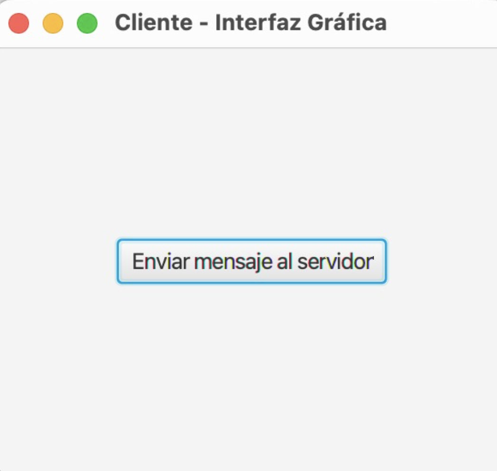
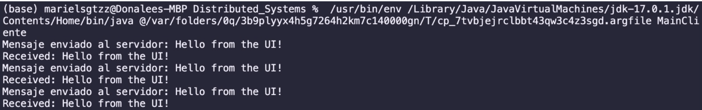
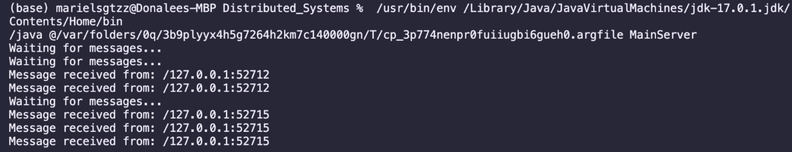
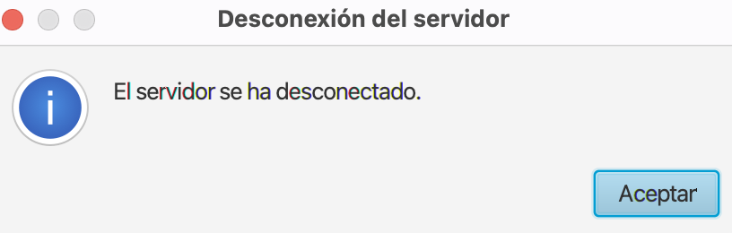
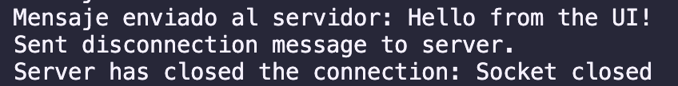
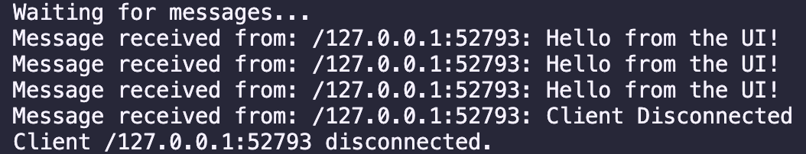
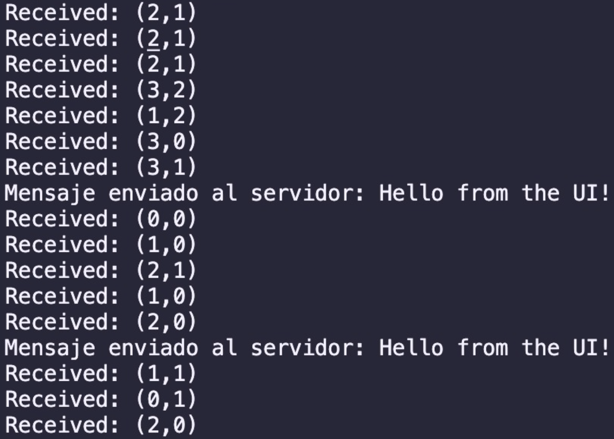
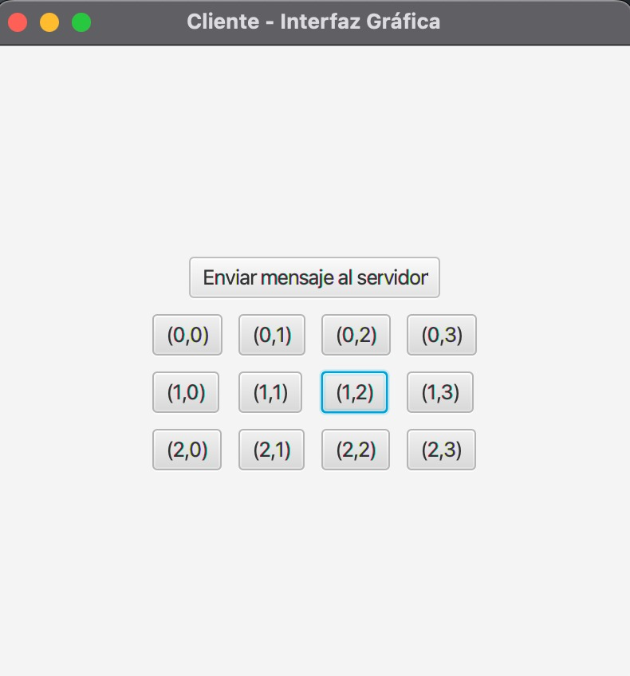
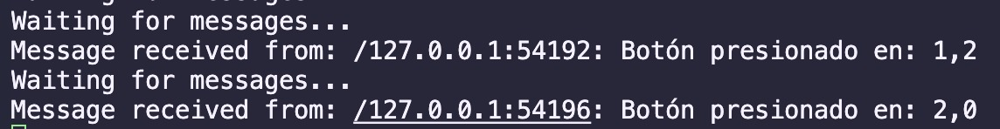

# Proyecto Alpha

Integrantes:

- Santiago Flores Larrondo
- Mariel Sofía Gutiérrez Zapién

Este proyecto es "Pégale al monstruo" el cual es básicamente un _Wack a Mole_.

El propósito de este proyecto es realizar el juego mediante TCP Sockets y Multicast.

En este proyecto hay dos partes principales, el cliente y el servidor.

Todos los clientes/usuarios verán una interfaz gráfica que es una cuadrícula.

El servidor va a enviarle a los clientes una dirección (vía Multicast). En dicha dirección de la cuadrícula, el cliente verá que "apareció" un monstruo.

La misión del usuario es darle al monstruo, entonces va a buscar darle _click_ a la casilla de la cuadrícula donde se encuentra el monstruo. Esta selección se envía al servidor como mensaje vía TCP sockets.

## Consideraciones importantes

El servidor manda monstruos cada 1000 milisegundos, indepentientemente de si hay o no clientes conectados.

El cliente que golpee 5 monstruos primero es el ganador.

El servidor le avisa a los clientes (también vía Multicast) quien ganó. Posteriormente, se reinicia el juego en automático.

**(FALTA)** Los clientes pueden entrar y salir del juego sin afectarlo. Sin embargo, la puntuación de los clientes se debe de mantener.

El juego necesita un sistema de login con `Sockets TCP`

Para que se puedan conectar clientes externos a la computadora donde se corre el servidor hay que:

1. Correr el servidor, en la terminal se imprimirá la dirección IP del servidor
2. Copiar esa dirección IP y reemplazar la IP de la línea `socket = new Socket("192.168.1.29", serverPort);` por la nueva

## Pasos Realizados

1. Usar los archivos de TCPSockets como base
2. Agregar JavaFX al proyecto para manejar la interfaz gráfica (https://www.youtube.com/watch?v=AubJaosfI-0&ab_channel=BoostMyTool)
3. Crear una interfaz gráfica básica para el cliente la cual tiene un botón. Cada vez que se le da `click` al botón el cliente le manda un mensaje al servidor. Varios clientes pueden estar mandando mensajes a la vez.
   

4. También se agregaron condiciones para que cuando el servidor se apague, que se le avise adecuadamente a los clientes. De la misma forma se le avisa al servidor cuando el cliente se desconecta.
   

   

   

5. De forma concurrente al paso 4, se hizo que el servidor mandara unas coordenadas cada 2 segundos a todos los clientes. Los clientes podían seguir mandando mensajes al servidor.
   

6. Se agregó una cuadrícula a la interfaz gráfica. Cuando se le da click a un botón las coordenadas son enviadas al servidor.
   
   

Para los pasos posteriores ver los commits de Github :)
